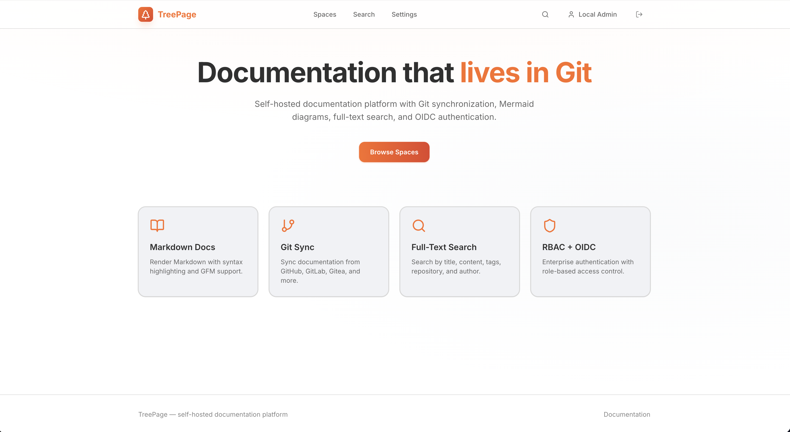
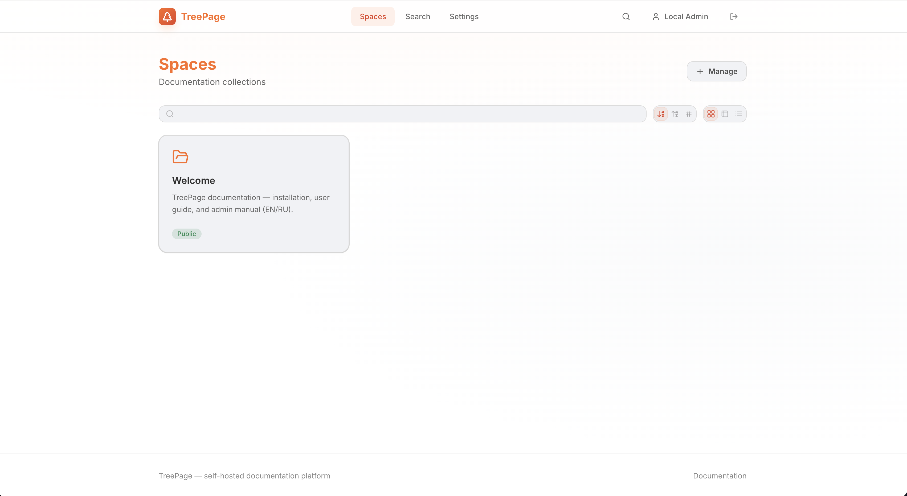
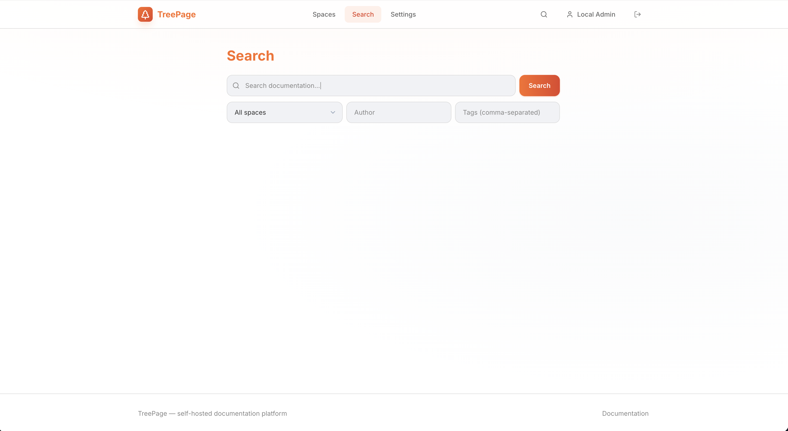

<p align="center">
  <a href="https://github.com/konstpic/treepage">
    
  </a>
</p>

<p align="center">
  Self-hosted documentation platform with Git synchronization, Markdown rendering, Mermaid diagrams, RBAC, and OIDC authentication.
</p>

<p align="center">
  <strong>Repository:</strong> <a href="https://github.com/konstpic/treepage">github.com/konstpic/treepage</a>
</p>

```bash
git clone https://github.com/konstpic/treepage.git
cd treepage
docker compose up --build
```

**First login:** http://localhost:5173/auth → `admin@local` / `admin` → http://localhost:5173/spaces/welcome

## Preview

<table>
  <tr>
    <td align="center" width="33%">
      
      <br /><sub>Landing</sub>
    </td>
    <td align="center" width="33%">
      
      <br /><sub>Spaces</sub>
    </td>
    <td align="center" width="33%">
      
      <br /><sub>Search</sub>
    </td>
  </tr>
</table>

## Documentation

Full user and admin guides: [docs/README.md](docs/README.md)

| English | Русский |
|---------|---------|
| [Installation](docs/en/installation/README.md) | [Установка](docs/ru/installation/README.md) |
| [Quick start](docs/en/getting-started/README.md) | [Быстрый старт](docs/ru/getting-started/README.md) |
| [User guide](docs/en/user/README.md) | [Руководство пользователя](docs/ru/user/README.md) |
| [Admin guide](docs/en/admin/README.md) | [Руководство администратора](docs/ru/admin/README.md) |
| [Operations](docs/en/operator/README.md) | [Эксплуатация](docs/ru/operator/README.md) |
| [Reference](docs/en/reference/README.md) | [Справочник](docs/ru/reference/README.md) |

Architecture: [EN](docs/en/reference/architecture.md) · [RU](docs/ru/reference/architecture.md)

```
frontend (React/Vite) → backend-auth (OIDC/JWT)
                      → backend-server (Docs API/Search/RAG)
                      → backend-sync (Git sync worker)
                      → PostgreSQL
```

## Quick Start (Docker Compose)

```bash
# Avoid BuildKit Bake EOF on Docker Desktop (see .env.example)
cp -n .env.example .env 2>/dev/null || true

# Start all services (pre-built backend + Vite frontend)
docker compose up --build

# Frontend:  http://localhost:5173
# Auth API:  http://localhost:8081
# Server API: http://localhost:8082
# Sync API:  http://localhost:8083
```

### Environment Variables (Secrets)

| Variable | Service | Description |
|----------|---------|-------------|
| `DB_PASSWORD` | all backends | PostgreSQL password |
| `JWT_SECRET` | auth, server | JWT signing secret |
| `OIDC_CLIENT_SECRET` | auth | OIDC client secret |
| `GIT_ACCESS_TOKEN` | sync | Git repository access token |
| `GIT_WEBHOOK_SECRET` | sync | Webhook validation secret |

Non-secret config is loaded from `/opt/app/conf/config.yml` (see `backend/*/conf/config.yml`).

## Local Development (without Docker)

### Prerequisites

- Go 1.22+
- Node.js 22+
- PostgreSQL 16+
- Git

### Backend

```bash
export DB_PASSWORD=treepage JWT_SECRET=dev-secret
export CONFIG_PATH=backend/auth/conf/config.yml

# Run migrations
psql -U treepage -d treepage -f migrations/001_initial_schema.up.sql

# Start services (separate terminals)
cd backend/auth && go run ./cmd
cd backend/server && CONFIG_PATH=conf/config.yml go run ./cmd
cd backend/sync && CONFIG_PATH=conf/config.yml go run ./cmd
```

### Frontend

```bash
cd frontend
npm install
VITE_API_URL=http://localhost:8082 VITE_AUTH_URL=http://localhost:8081 npm run dev
```

## Production (Kubernetes / Helm)

TreePage ships **open-source Helm charts** (no external chart dependencies). Standard Deployments, Services, Ingress, ConfigMaps, and Secrets.

| Release | Chart | Values |
|---------|-------|--------|
| Backend | [`backend/`](backend/) (auth, server, sync) | [`backend/values.yaml`](backend/values.yaml) |
| Frontend | [`.helm/frontend/`](.helm/frontend/) | [`.helm/frontend/values.yaml`](.helm/frontend/values.yaml) |
| Full stack (optional) | [`deploy/helm/treepage/`](deploy/helm/treepage/) | umbrella |

See [docs/en/reference/helm-deployment.md](docs/en/reference/helm-deployment.md) (EN) or [docs/ru/reference/helm-deployment.md](docs/ru/reference/helm-deployment.md) (RU) for build, install, and migration from legacy uc/react-spa values.

```bash
# Split releases (same host, merged ingress paths)
helm upgrade --install treepage-backend backend/ -f backend/values.yaml \
  --set ingress.host=docs.example.com \
  --set secret.dbPassword='...' --set secret.jwtSecret='...'

helm upgrade --install treepage-frontend .helm/frontend/ -f .helm/frontend/values.yaml \
  --set ingress.host=docs.example.com \
  --set backend.releaseName=treepage-backend

# Or umbrella chart
helm dependency update deploy/helm/treepage
helm upgrade --install treepage deploy/helm/treepage -f deploy/helm/treepage/values.yaml
```

Compatible with ArgoCD GitOps workflows.

## API Documentation

OpenAPI spec: [openapi/openapi.yaml](openapi/openapi.yaml)

### Admin API (`backend-server`, `/api/admin/*`)

| Method | Path | Description |
|--------|------|-------------|
| GET/PUT | `/api/admin/system-settings` | Platform auth, git, and search configuration |
| GET/POST | `/api/admin/repositories` | List or create Git-backed repositories |
| POST | `/api/admin/spaces/{id}/bind-repo` | Reassign a repository to a space |
| POST | `/api/admin/sync/{repoId}` | Trigger manual sync (proxies to sync service) |
| GET/POST/PUT/DELETE | `/api/admin/oidc-providers` | OIDC provider CRUD (super_admin) |
| GET | `/api/admin/users` | User list (super_admin) |

Admin UI routes: `/admin/spaces`, `/admin/repositories`, `/admin/settings`, `/admin/oidc`, `/admin/users`.

## RBAC Roles

| Role | Capabilities |
|------|--------------|
| `super_admin` | System settings, OIDC, users, all spaces |
| `admin` | Manage spaces, repos, members |
| `editor` | Create/edit docs, trigger sync |
| `viewer` | Read documentation |

## Project Structure

```
treepage/
├── backend/
│   ├── pkg/          # Shared libraries (config, jwt, health, models)
│   ├── auth/         # OIDC + JWT service
│   ├── server/       # Documentation API + search
│   └── sync/         # Git synchronization worker
├── frontend/         # React + Vite UI (bot-pay design system)
├── migrations/       # PostgreSQL schema
├── backend/          # Go services + Helm chart (auth, server, sync)
├── .helm/frontend/   # Frontend Helm chart (React SPA + nginx)
├── deploy/           # Production Dockerfiles + umbrella Helm chart
├── deploy/docker/    # Dockerfiles for local dev
├── openapi/          # API specification
└── docs/             # User/admin guides (en/ + ru/)
```

## License

MIT
