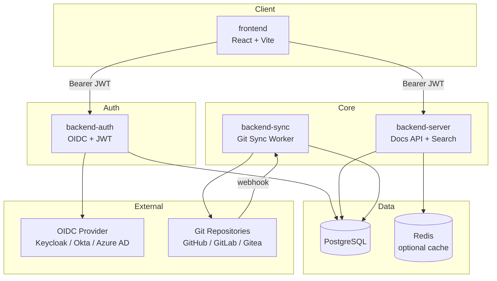
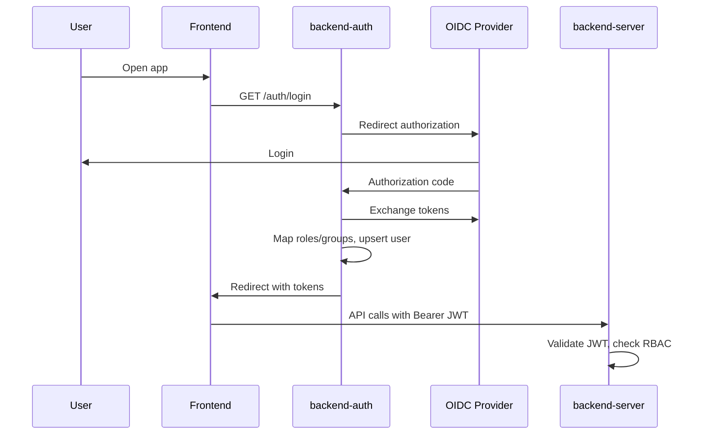
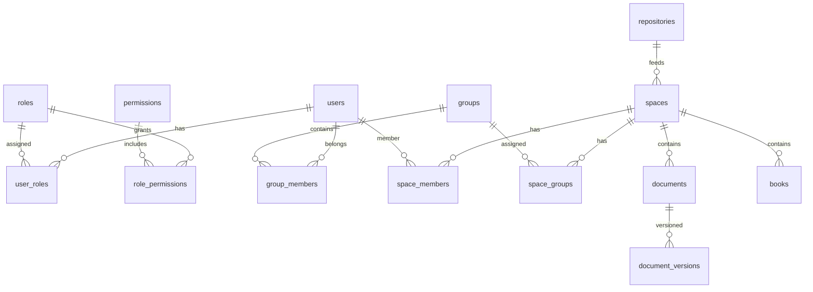

# TreePage architecture

## System overview



## Microservices

| Service | Port (dev) | Responsibility |
|---------|------------|----------------|
| frontend | 5173 | UI, markdown/mermaid, admin panel |
| backend-auth | 8081 | OIDC, JWT issue/refresh, user sync |
| backend-server | 8082 | Spaces, documents, search, RBAC, admin API |
| backend-sync | 8083 | Git clone, parse, index, webhooks |
| postgres | 5432 | Primary datastore |
| redis | 6379 | Cache (optional) |

## Authentication Flow



## RBAC Model



### Roles

| Role | Scope | Capabilities |
|------|-------|--------------|
| super_admin | System | All settings, OIDC, users, repos |
| admin | System/Space | Manage spaces, repos, members |
| editor | Space | Create/edit docs, trigger sync |
| viewer | Space | Read docs |

Details: [RBAC](../admin/rbac.md)

## Search Architecture

- **Phase 1:** PostgreSQL `tsvector` full-text search on title, content, tags.
- **Phase 2:** OpenSearch adapter (interface in `backend/server/internal/search`).

Search fields: title, content, tags, repository, author.

## Git Sync Architecture

```
Git Repo → backend-sync (clone + parse) → PostgreSQL (documents)
                ↑
    scheduled / manual / webhook triggers
```

Server proxies sync requests to sync worker via `SYNC_SERVICE_URL`.

## Configuration

```
/opt/app/conf/config.yml   ← non-secret defaults
Environment variables      ← secrets + overrides
```

Load order: YAML → ENV override → validation → fail fast.

## Kubernetes Probes

All Go services expose:

| Endpoint | Purpose |
|----------|---------|
| `/liveness` | Process alive |
| `/readiness` | DB connected |
| `/metrics` | Prometheus metrics |

## Security

- JWT validation on all protected routes
- CSRF token for OIDC state
- Rate limiting (in-memory or Redis)
- Audit log for admin actions
- Secure headers (HSTS, X-Frame-Options, CSP)
- Secrets only via ENV

## Deployment

| Environment | Tool |
|-------------|------|
| Local dev | Docker Compose + hot reload |
| Production | Open-source Helm charts (`backend/`, `.helm/frontend/`) |

See [Kubernetes / Helm](../installation/kubernetes.md), [Helm deployment](helm-deployment.md).

## LLM Integration

Optional OpenAI-compatible API for:

- AI book generation (structure + introduction)
- Document auto-translation

Configured via `LLM_*` env vars on backend-server.
