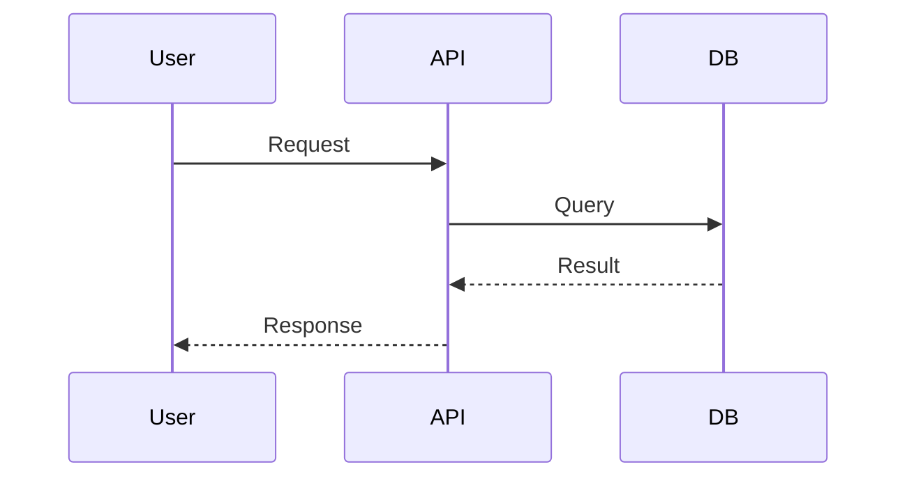

# Editing documents

> Requires **editor** role or higher in the space (or system role `admin`/`super_admin`).

## Opening the editor

1. Open a document
2. Click **Edit**
3. Switch between **Editor** and **Preview**

## Creating a new page

1. Open a space
2. Click **New page** (if available)
3. Fill in:
   - **Title**
   - **Path** (e.g. `guides/intro.md`)
   - **Markdown content**
4. Save

## Editing an existing page

| Field | Description |
|-------|-------------|
| Title | Display name of the page |
| Content | Markdown text |

Saving creates a new document **version**.

## Drafts

- **Save as draft** — saves the page with `is_published = false`; only editors see it in the space tree (marked **Draft**)
- **Publish** — makes the page visible to all space members with read access
- For Git-linked pages, **Send PR** still pushes upstream separately from local publish

## Attachments

Editors can upload files (up to 10 MiB) on the document page. Files are stored on the server (`ATTACHMENTS_DIR`) and linked to the document.

## Favorites and recent

- Star a document to add it to **My pages** (`/me`)
- Recently viewed documents appear automatically on the same page
- Notifications about publishes and new documents appear in the bell icon in the navigation bar

## Git-backed documents

If a page is synchronized from Git:

- Editing in TreePage saves a local copy in the database
- To publish upstream — create a PR in the Git repository
- On the next sync, the Git version may overwrite local changes

**Recommendation:** for Git-backed documents, edit files in the repository, not in the UI.

## Version history

After saving:

1. Open **Version history**
2. Select a version to view
3. Click **Compare with v{N}** for a diff

## Markdown tips

### Headings

```markdown
# H1 — page title
## H2 — section
### H3 — subsection
```

### Code

````markdown
```python
def hello():
    print("Hello, TreePage!")
```
````

### Mermaid

````markdown

````

### Tables

```markdown
| Column 1 | Column 2 |
|----------|----------|
| Value    | Value    |
```

### Tags (for search)

```markdown
tags: deployment, kubernetes

# Title
```

## Synchronization after Git changes

If you edited files in Git:

1. Push
2. Click **Synchronize** in the space sidebar
3. Or wait for scheduled sync / webhook

Details: [Git Sync (admin)](../admin/git-sync.md)

## Related sections

- [Reading documents](reading-docs.md)
- [Git Sync](../admin/git-sync.md)
