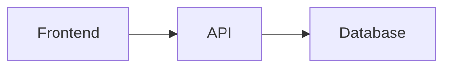

# Reading documents

## Opening a document

1. Go to a space (`/spaces/{slug}`)
2. Select a page in the tree on the left
3. The document opens in the main area

Document URL: `/spaces/{slug}/docs/{doc-slug}`

## Formatting

TreePage renders **Markdown** with support for:

| Feature | Description |
|---------|-------------|
| GFM | Tables, checklists, strikethrough |
| Syntax highlighting | Code highlighting in fenced blocks |
| Mermaid | Diagrams: flowchart, sequence, gantt, ER, etc. |
| Headings | Automatic table of contents via breadcrumbs |

### Mermaid diagrams

````markdown

````

Diagrams can be expanded to full screen (**Expand** button).

## Breadcrumbs

Above the document, a navigation trail is shown:

```
Space > Folder > Document
```

Each element is a link for quick navigation.

## Comments

Signed-in users see a **Comments** column on the right. You can discuss the page and mention colleagues with `@` — they receive a notification with a link to your comment.

Details: [Comments and notifications](comments-and-notifications.md)

## Auto-translation

If the administrator enabled **Document auto-translation**, pages are translated to the interface language via LLM. Translated pages show an "Automatically translated" label.

## Version history

Click **Version history** to view:

- List of saved document versions
- Comparison (diff) between two versions

Versions are created on each save through the TreePage editor.

## Documents from Git

If a document is synchronized from a Git repository, a hint is shown when editing:

> Page is linked to Git. Changes are saved in TreePage — create a PR in the repository to publish them upstream.

Recommended workflow for Git-backed documents:

1. Edit Markdown in the Git repository
2. Push / merge
3. Wait for synchronization (scheduled or webhook)
4. Changes appear in TreePage

## Direct links

Documents can be opened via direct link — convenient for sharing:

```
https://docs.example.com/spaces/engineering/docs/guides/installation
```

Comment anchor (after sign-in):

```
https://docs.example.com/spaces/engineering/docs/guides/installation#comment-{uuid}
```

## Related sections

- [Comments and notifications](comments-and-notifications.md)
- [Editing documents](editing-docs.md)
- [Search](search.md)
