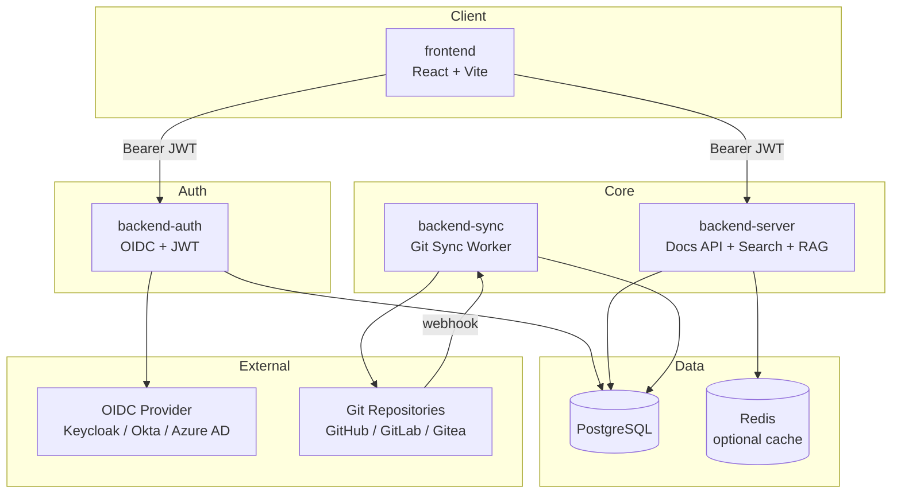
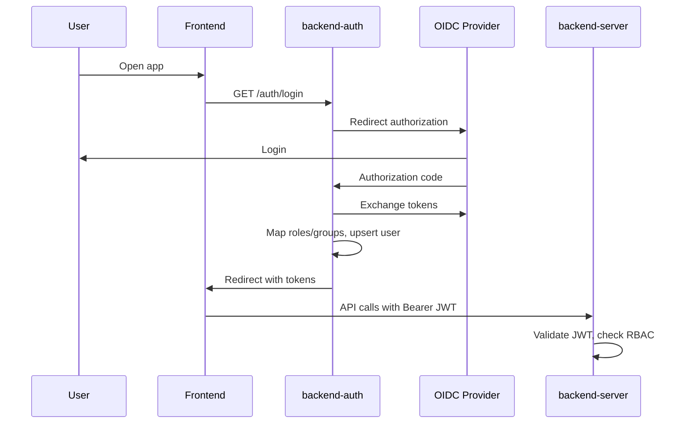
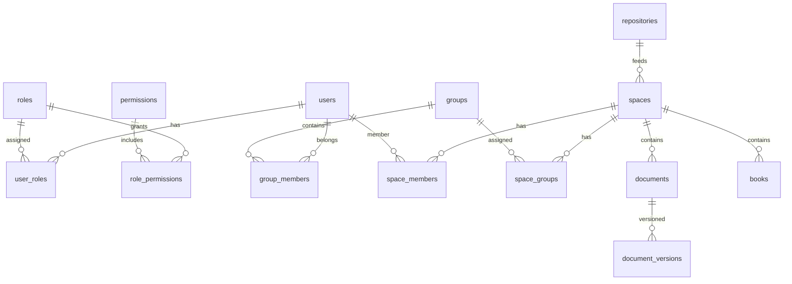

# Архитектура TreePage

## Обзор системы



## Микросервисы

| Сервис | Порт (dev) | Ответственность |
|--------|------------|-----------------|
| frontend | 5173 | UI, markdown/mermaid, admin panel |
| backend-auth | 8081 | OIDC, JWT issue/refresh, user sync |
| backend-server | 8082 | Spaces, documents, search, RAG, RBAC, admin API |
| backend-sync | 8083 | Git clone, parse, index, webhooks |
| postgres | 5432 | Primary datastore |
| redis | 6379 | Cache (optional) |

## Authentication Flow



## RBAC Model



### Роли

| Роль | Scope | Capabilities |
|------|-------|--------------|
| super_admin | System | All settings, OIDC, users, repos |
| admin | System/Space | Manage spaces, repos, members |
| editor | Space | Create/edit docs, trigger sync |
| viewer | Space | Read docs |

Подробнее: [RBAC](../admin/rbac.md)

## Search Architecture

### Full-text search (Phase 1+)

PostgreSQL `tsvector` on title, content, tags. Permission-aware: only spaces and pages the user can read.

### Multilingual FTS (015)

Configs `english`, `russian`, `simple` — Cyrillic and Latin queries in search and RAG retrieval.

### RAG (Phase 3 + 016)

```
User question → retrieval (FTS + keywords + ILIKE + vector)
             → rank + page ACL filter
             → LLM (OpenAI-compatible)
             → answer + sources + citations + confidence
```

- Chunks: `document_chunks` (indexed on Git sync, backfill on startup)
- Embeddings: optional hybrid search (`EMBEDDING_ENABLED`)
- Feedback: `POST /api/rag/feedback` → learned synonyms
- UI: `/search` → **Ask documentation**

Подробнее: [Дорожная карта](roadmap.md), [Поиск](../user/search.md).

### OpenSearch (Phase 2, opt-in)

`SEARCH_BACKEND=opensearch` + `OPENSEARCH_URL` — adapter in `backend/server/internal/search` (currently delegates to PostgreSQL).

## Git Sync Architecture

```
Git Repo → backend-sync (clone + parse + RAG index) → PostgreSQL (documents, document_chunks)
                ↑
    scheduled / manual / webhook triggers
```

- **Phase 1:** documents with `has_pending_changes` are skipped (not overwritten)
- **Phase 2:** orphan documents removed after sync (except pending changes)
- Server proxies sync via `SYNC_SERVICE_URL` + `INTERNAL_SERVICE_TOKEN`

## Configuration

```
/opt/app/conf/config.yml   ← non-secret defaults
Environment variables      ← secrets + overrides
```

Load order: YAML → ENV override → validation → fail fast.

## Kubernetes Probes

All Go services expose:

| Endpoint | Purpose |
|----------|---------|
| `/liveness` | Process alive |
| `/readiness` | DB connected |
| `/metrics` | Prometheus metrics |

## Security

- JWT validation on all protected routes
- **INTERNAL_SERVICE_TOKEN** between server and sync (Phase 1)
- CSRF token for OIDC state
- Rate limiting (in-memory or Redis)
- Audit log for admin actions
- **Page ACL** — permissions below space level (Phase 3)
- Secure headers (HSTS, X-Frame-Options, CSP)
- Secrets only via ENV

## Deployment

| Environment | Tool |
|-------------|------|
| Local dev | Docker Compose (pre-built backend + Vite frontend) |
| Production | Open-source Helm charts (`backend/`, `.helm/frontend/`) |

См. [Docker Compose](../installation/docker-compose.md), [Kubernetes / Helm](../installation/kubernetes.md), [Helm deployment](helm-deployment.md).

## LLM Integration

OpenAI-compatible API (`LLM_*` env) on **backend-server**:

| Use case | Phase |
|----------|-------|
| AI book generation | Core |
| Document auto-translation | Core |
| RAG answers (`/api/rag/ask`) | 3 + 016 |
| Query expansion for retrieval | 016 |
| Embeddings (`EMBEDDING_*`) | 016 |

Local Ollama example:

```bash
LLM_ENABLED=true
LLM_API_URL=http://host.docker.internal:11434/v1
LLM_MODEL=llama3.2:latest
EMBEDDING_ENABLED=true
EMBEDDING_MODEL=nomic-embed-text
```

См. [Конфигурация](../operator/configuration.md), [Дорожная карта](roadmap.md).
