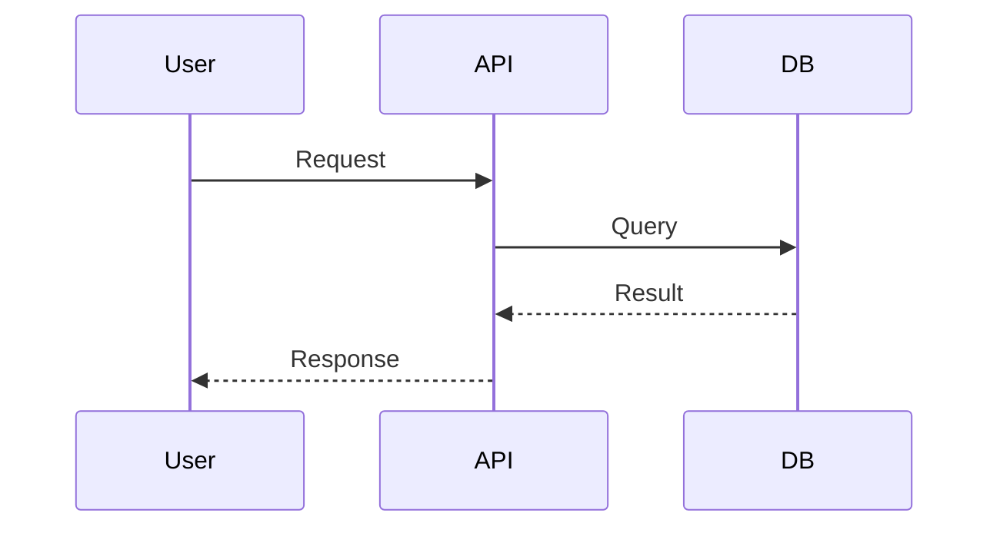

# Редактирование документов

> Требуется роль **editor** или выше в пространстве (или системная роль `admin`/`super_admin`).

## Открытие редактора

1. Откройте документ
2. Нажмите **Редактировать**
3. Переключайтесь между **Редактор** и **Просмотр**

## Создание новой страницы

1. Откройте пространство
2. Нажмите **Новая страница** (если доступно)
3. Заполните:
   - **Заголовок**
   - **Путь** (например `guides/intro.md`)
   - **Содержимое Markdown**
4. Сохраните

## Редактирование существующей страницы

| Поле | Описание |
|------|----------|
| Заголовок | Отображаемое имя страницы |
| Содержимое | Markdown-текст |

При сохранении создаётся новая **версия** документа.

## Git-backed документы

Если страница синхронизирована из Git:

- Редактирование в TreePage сохраняет локальную копию в БД
- Для публикации upstream — создайте PR в Git-репозитории
- При следующей синхронизации Git-версия может перезаписать локальные изменения

**Рекомендация:** для Git-backed документов редактируйте файлы в репозитории, а не в UI.

## История версий

После сохранения:

1. Откройте **История версий**
2. Выберите версию для просмотра
3. Нажмите **Сравнить с v{N}** для diff

## Markdown-подсказки

### Заголовки

```markdown
# H1 — заголовок страницы
## H2 — раздел
### H3 — подраздел
```

### Код

````markdown
```python
def hello():
    print("Hello, TreePage!")
```
````

### Mermaid

````markdown

````

### Таблицы

```markdown
| Колонка 1 | Колонка 2 |
|-----------|-----------|
| Значение  | Значение  |
```

### Теги (для поиска)

```markdown
tags: deployment, kubernetes

# Заголовок
```

## Синхронизация после изменений в Git

Если вы редактировали файлы в Git:

1. Сделайте push
2. Нажмите **Синхронизировать** в боковой панели пространства
3. Или дождитесь scheduled sync / webhook

Подробнее: [Git Sync (admin)](../admin/git-sync.md)

## Связанные разделы

- [Чтение документов](reading-docs.md)
- [Git Sync](../admin/git-sync.md)
