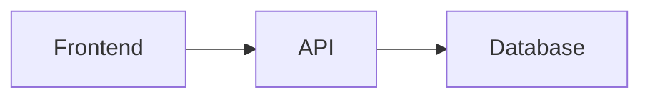

# Чтение документов

## Открытие документа

1. Перейдите в пространство (`/spaces/{slug}`)
2. Выберите страницу в дереве слева
3. Документ откроется в основной области

URL документа: `/spaces/{slug}/docs/{doc-slug}`

## Форматирование

TreePage рендерит **Markdown** с поддержкой:

| Возможность | Описание |
|-------------|----------|
| GFM | Таблицы, чеклисты, зачёркивание |
| Syntax highlighting | Подсветка кода в fenced blocks |
| Mermaid | Диаграммы: flowchart, sequence, gantt, ER и др. |
| Заголовки | Автоматическое оглавление через breadcrumbs |

### Mermaid-диаграммы

````markdown

````

Диаграммы можно развернуть на весь экран (кнопка **Развернуть**).

## Breadcrumbs

Над документом отображается навигационная цепочка:

```
Пространство > Папка > Документ
```

Каждый элемент — ссылка для быстрого перехода.

## Комментарии

Авторизованным пользователям справа показывается колонка **Комментарии**. Можно обсуждать страницу и упоминать коллег через `@` — они получат уведомление со ссылкой на комментарий.

Подробнее: [Комментарии и уведомления](comments-and-notifications.md)

## Автоперевод

Если администратор включил **Автоперевод документов**, страницы переводятся на язык интерфейса через LLM. На переведённых страницах отображается метка «Переведено автоматически».

## История версий

Нажмите **История версий** для просмотра:

- Список сохранённых версий документа
- Сравнение (diff) между двумя версиями

Версии создаются при каждом сохранении через редактор TreePage.

## Документы из Git

Если документ синхронизирован из Git-репозитория, при редактировании отображается подсказка:

> Страница связана с Git. Изменения сохраняются в TreePage — создайте PR в репозитории, чтобы опубликовать их upstream.

Рекомендуемый workflow для Git-backed документов:

1. Редактируйте Markdown в Git-репозитории
2. Сделайте push / merge
3. Дождитесь синхронизации (scheduled или webhook)
4. Изменения появятся в TreePage

## Прямые ссылки

Документы можно открывать по прямой ссылке — удобно для sharing:

```
https://docs.example.com/spaces/engineering/docs/guides/installation
```

Якорь комментария (нужен вход):

```
https://docs.example.com/spaces/engineering/docs/guides/installation#comment-{uuid}
```

## Связанные разделы

- [Комментарии и уведомления](comments-and-notifications.md)
- [Редактирование документов](editing-docs.md)
- [Поиск](search.md)
